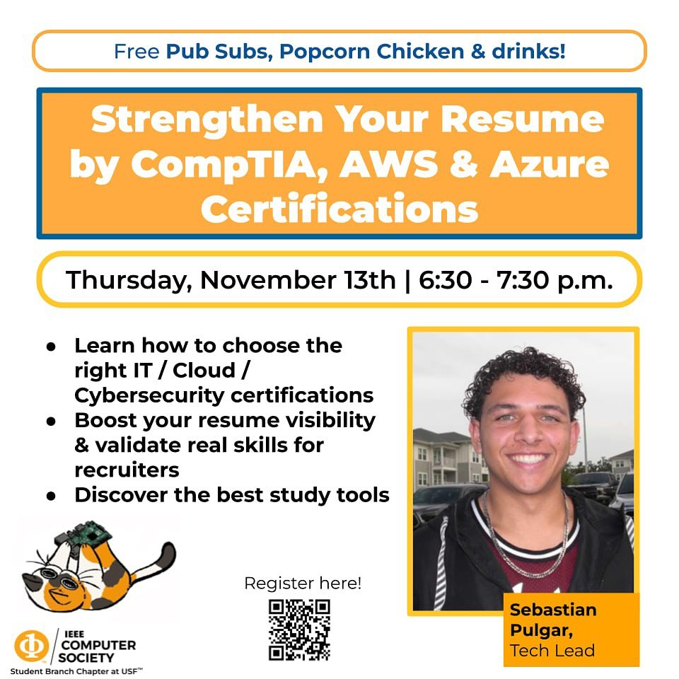

# Strengthen Your Resume by CompTIA, AWS & Azure Certifications

A career workshop run by the IEEE Computer Society student branch chapter at the University of South Florida, led by tech lead Sebastian Pulgar.

Thursday, November 13, 2025, 6:30 to 7:30 PM.

## What we covered

- Picking an IT, cloud, or cybersecurity certification that matches where you want to end up, across CompTIA, AWS, and Microsoft Azure.
- Which ones hiring managers actually weigh, based on what industry professionals told us.
- Why a credential like Security+ or AWS Cloud Practitioner changes what recruiters find, since LinkedIn filters search for those names directly.
- Study tools worth the money and time.

## Files

- `Certification Workshop.pptx`, the slides.

## Links

- [Announcement on Instagram](https://www.instagram.com/p/DQ4kcQ-DjL_/)
- [Recap on Instagram](https://www.instagram.com/p/DRPZmDYjNsg/)
